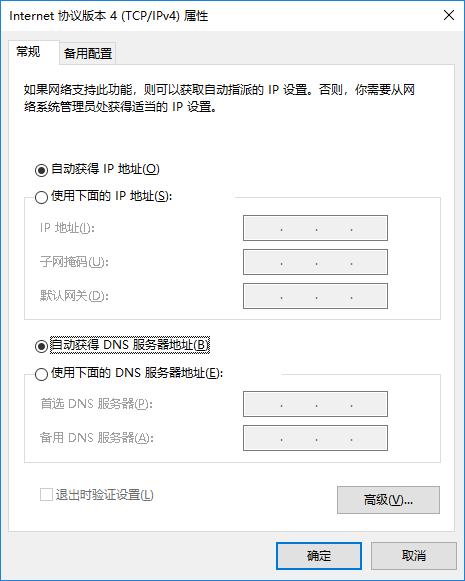
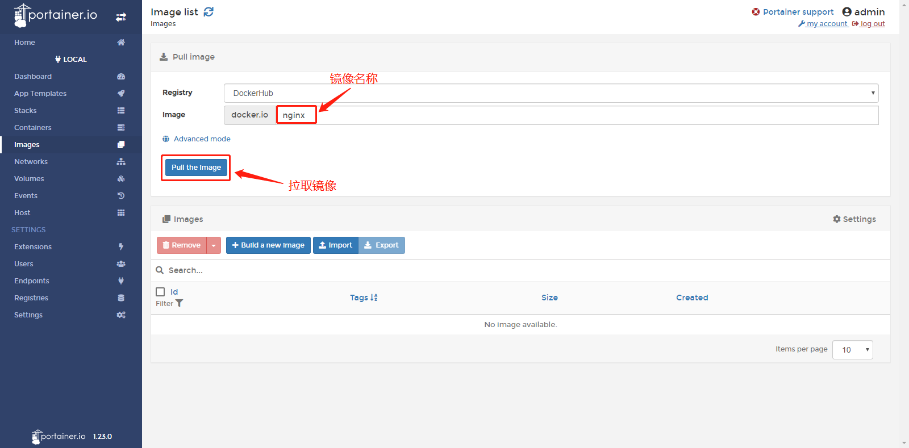
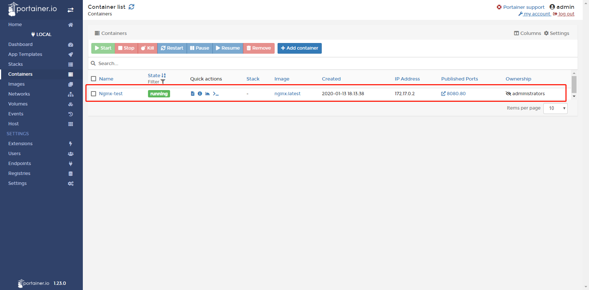
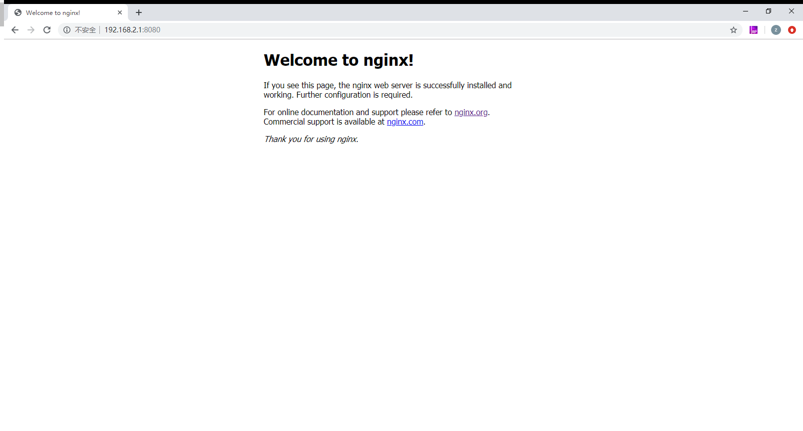

# InGateway902 Docker用户手册
InGateway902系列边缘计算网关（以下简称IG902）支持托管docker镜像，您可以将您的docker镜像发布到IG902上，快速部署和运行您自行开发的应用程序。为了说明如何使用IG902的Docker环境，本文档将演示如何在IG902上运行一个Nginx镜像，该镜像用于HTTP，HTTPS，SMTP，POP3和IMAP协议的开源反向代理服务器，以及负载平衡器，HTTP缓存和Web服务器。   
Docker 是一个开源的应用容器引擎，让开发者可以打包他们的应用以及依赖包到一个可移植的容器中,然后发布到任何流行的Linux机器或Windows 机器上,也可以实现虚拟化,容器是完全使用沙箱机制,相互之间不会有任何接口。

## 1.准备IG902硬件设备及其网络环境
### 1.1 接通IG902电源并使用网线连接PC
接通IG902的电源并按照拓扑使用以太网线连接PC和IG902。   

### 1.2 设置LAN网络参数：在局域网访问IG902
- 步骤1：IG902的GE 0/2口的默认ip地址为192.168.2.1，设置PC的IP地址与GE 0/2口处于同一网段。  
  - 方法一：自动获取IP地址（推荐）  

       
 &nbsp;

  - 方法二：使用固定IP地址   
    选择“使用下面的IP地址”，输入IP地址（默认为192.168.2.2~192.168.2.254中任意值）；子网掩码（默认255.255.255.0）；默认网关（默认为192.168.2.1）以及DNS服务器地址，单击“确定”。  

       
 

- 步骤2：打开浏览器，访问IG902的GE 0/2口IP地址并输入用户名和密码以登录IG902的WEB管理页面。用户名/密码默认为adm/123456。
   
 &nbsp;

- 步骤3：登录成功后，您可以看到如下图所示的网页：
  
 &nbsp;

- 步骤4：如需修改WEB管理界面的用户名和密码可进入IG902的“系统管理>>用户管理”页面管理用户名和密码。
 
&nbsp;

- 步骤5：如需修改GE 0/2口的IP地址可访问IG902的“网络>>网络接口>>以太网>>千兆以太网0/2”页面进行修改。
  

### 1.3 设置WAN网络参数：连接Internet
  - 方法一：使用SIM卡连接Internet
    - 步骤1：将SIM卡插入卡槽（注意：插拔SIM卡时，必须拔掉设备电源，以免造成数据丢失或设备损坏）。插入SIM卡后将4G LTE天线与ANT口连接，接通IG902的电源。   

         
 &nbsp;

    - 步骤2：进入IG902的“网络>>网络接口>>蜂窝网”页面，勾选“启用蜂窝网”并点击“提交。

&nbsp;

      待网络连接状态显示“连接”并且分配相应IP地址等网络参数时说明IG902已通过SIM卡联网。 
      
&nbsp;
 
  - 方法二：使用以太网连接Internet
    - 步骤1：分别使用以太网线连接IG902的GE 0/1和GE 0/2口，如下图： 
 
         
   &nbsp;

    - 步骤2：进入IG902的“网络>>网络接口>>以太网>>千兆以太网0/1”页面，配置GE 0/1口的IP地址（网络类型为静态IP地址时需要根据现场网络情况配置IP、子网掩码等信息）并点击“提交”。

         
   &nbsp;

    - 步骤3：进入IG902的“网络>>静态路由>>配置”页面，为GE 0/1口添加静态路由（接口项选择“Gigabitethernet 0/1”，其余项根据现场网络情况配置）并点击“提交”。
   
   &nbsp;
    - 步骤4：进入IG902的“系统管理>>工具”页面，使用Ping工具检测IG902是否成功接入Internet。如下图所示说明已成功接入Internet：
  

### 1.4 更新IG902固件版本
如需获取IG902产品最新固件版本及其功能特性信息，请联系客服。如需更新IG902的固件版本，请参考如下方法：（固件版本应为2.0.0.r12057及以上）    
进入IG902的“系统管理>>固件升级”页面，选择相应的固件文件后点击“开始升级”。IG902升级完成后，会提示您需要重启设备以应用新的固件。建议升级前确保IG902已开启https服务，否则升级后无法通过WEB页面访问IG902。

 &nbsp;

## 2.启用并配置Docker管理器
### 2.1 安装Docker SDK并启用Docker管理器
Docker SDK集成了运行docker镜像所需的运行环境以及docker镜像管理器，在使用Docker前必须先安装Docker SDK。如需获取Docker SDK请联系客服。   
- 步骤1：已有Docker SDK后，进入IG902的“边缘计算>>Docker管理”页面，关闭Docker管理器并导入Docker SDK。
   
   &nbsp;

- 步骤2：导入后，IG902将自动安装Docker SDK，安装过程通常需要1-2分钟，请耐心等候。安装成功后，勾选启用Docker管理器并点击“提交”。
   
   &nbsp;
   
- 步骤3：启用Docker管理器后，可以修改访问Docker管理器的端口号和登录密码。

### 2.2 配置Docker管理器--Portainer
IG902使用Portainer构建，管理和维护Docker镜像和容器。关于Portainer的详细介绍和使用说明请查看[Portainer官网](https://www.portainer.io/overview/)。本文档将为您演示如何在IG902上添加并部署运行一个Nginx docker镜像。

#### 2.2.1 访问Portainer
- 步骤1：点击Portainer的访问按钮，随后Portainer会提示您需要输入用户名和密码。此时从IG902的“边缘计算>>Docker管理”页面复制用户名和设置的密码后并点击“登录”即可。

   
   &nbsp;
   
- 步骤2：登录成功后如下图所示，选择“Local”以使用Portainer管理IG902上的docker镜像，随后点击“Connect”。
   
   &nbsp;
   
- 步骤3：在Portainer的“Home”页面，选择local以管理IG902上的docker镜像。
   
   &nbsp;
   
  随后会跳转至本地仪表板，可在此页面概览IG902的容器和镜像等信息。

#### 2.2.2 添加docker镜像
为Portainer添加docker镜像的方法有两种
- 方法1：从IG902的“边缘计算>>Docker管理”页面导入本地docker镜像。（导入所需时间根据docker镜像大小而不同；当docker镜像较大时，请耐心等待）
   
   &nbsp;
   
  导入后在Portainer的“Local>>Images”页面可以看到导入成功的docker镜像。
   
   &nbsp;
   
- 方法2：进入Portainer的“Local>>Images”页面，从DockerHub中下载“nginx”docker镜像。（下载镜像所需时间根据镜像大小而不同；当docker镜像较大时，请耐心等待）
   
   &nbsp;
   
  docker镜像下载完成后如下图所示，在Portainer的“Local>>Images”中能够看到相应的docker镜像信息。

#### 2.2.3 配置并部署容器
- 步骤1：进入Portainer的“Local>>Containers”页面，点击“Add container”以添加一个新容器。
   
   &nbsp;
   
- 步骤2：为容器配置运行参数并部署容器。
   
   &nbsp;
   
- 步骤3：部署后容器会自动运行，在Portainer的“Local>>Containers”页面可以查看容器运行情况。
   
   &nbsp;
   
- 步骤4：在浏览器中输入容器中配置的Nginx访问链接（IG902的IP地址 + 端口号）后可以看到Nginx的欢迎页面。说明Nginx docker镜像已正常运行在IG902上；至此，完成了在IG902上添加并部署运行一个Nginx docker镜像。

## 3. 附录
### 3.1 如何从gitlab/github上下载docker镜像
在Portainer的“Local>>Registries”页面点击“Add registry”以添加docker镜像仓库（必须为公开的仓库）。
   

随后选择“Custom registry”并配置镜像仓库信息，配置完毕后点击“Add registry”。
   

镜像仓库添加成功后如下图所示：
   

添加成功后，在拉取docker镜像时可以选择已配置的镜像仓库。

