# **第一章 MobiusPi Python开发快速入门**
MobiusPi是北京映翰通网络技术股份有限公司InGateway系列软硬件产品的代号。  <br/>InGateway系列产品包含两个大的产品系列，InGateway900和InGateway500系列。本文档旨在为用户说明如何使用MobiusPi硬件产品进行Python开发， 以下文档中将InGateway500简称为“IG500”；InGateway900简称为“IG900”。

## 第一节 搭建MobiusPi开发环境
### 1. 准备硬件设备及其网络环境
#### 1.1 接通电源并使用网线连接PC
- 准备IG500硬件设备  
  
  接通IG500的电源并按照拓扑使用以太网线连接PC和IG500。  <br/>
  

- 准备IG900硬件设备  
  
  接通IG900的电源并按照拓扑使用以太网线连接PC和IG900。  <br/>

#### 1.2 设置LAN网络参数
- 设置IG500LAN网络参数，请参考[在局域网访问IG500](https://ingateway-development-docs.readthedocs.io/zh_CN/latest/IG501%E5%BF%AB%E9%80%9F%E4%BD%BF%E7%94%A8%E6%89%8B%E5%86%8C.html#lan-ig501)。
- 设置IG900LAN网络参数，请参考[在局域网访问IG900](https://ingateway-development-docs.readthedocs.io/zh_CN/latest/IG902%E5%BF%AB%E9%80%9F%E4%BD%BF%E7%94%A8%E6%89%8B%E5%86%8C.html#lan-ig902)。

#### 1.3 设置WAN网络参数
- 设置IG500 WAN网络参数，请参考[IG500连接Internet](https://ingateway-development-docs.readthedocs.io/zh_CN/latest/IG501%E5%BF%AB%E9%80%9F%E4%BD%BF%E7%94%A8%E6%89%8B%E5%86%8C.html#wan-internet)。
- 设置IG900 WAN网络参数，请参考[IG900连接Internet](https://ingateway-development-docs.readthedocs.io/zh_CN/latest/IG902%E5%BF%AB%E9%80%9F%E4%BD%BF%E7%94%A8%E6%89%8B%E5%86%8C.html#wan-internet)。

#### 1.4 更新软件版本
如需获取MobiusPi产品最新软件版本及其功能特性信息，请联系客服。如需更新软件版本，请参考如下链接：
- [更新IG500软件版本](https://ingateway-development-docs.readthedocs.io/zh_CN/latest/IG501%E5%BF%AB%E9%80%9F%E4%BD%BF%E7%94%A8%E6%89%8B%E5%86%8C.html#id1)
- [更新IG900软件版本](https://ingateway-development-docs.readthedocs.io/zh_CN/latest/IG902%E5%BF%AB%E9%80%9F%E4%BD%BF%E7%94%A8%E6%89%8B%E5%86%8C.html#id1)
#### 1.5 启用MobiusPi的调试模式
开发过程中，为了在MobiusPi上运行并调试Python代码，需要启用MobiusPi的调试模式。
- [启用IG500调试模式](https://ingateway-development-docs.readthedocs.io/zh_CN/latest/IG501%E5%BF%AB%E9%80%9F%E4%BD%BF%E7%94%A8%E6%89%8B%E5%86%8C.html#id3)
- [启用IG900调试模式](https://ingateway-development-docs.readthedocs.io/zh_CN/latest/IG902%E5%BF%AB%E9%80%9F%E4%BD%BF%E7%94%A8%E6%89%8B%E5%86%8C.html#id3)

### 2. 安装PC上需要的软件
#### 2.1 安装Python解释器
在开发过程中PC需具备Python2.7.X或3.7.X解释器（建议使用3.7.X解释器），您可以访问 https://www.python.org/downloads/ 下载相应的安装包并安装至PC。


#### 2.2 安装Visual Studio Code软件
您可以访问：https://code.visualstudio.com/Download 获取相应的Visual Studio Code软件（以下简称VS Code）。

 &nbsp;

下载完成后运行安装程序，安装成功后打开VS Code软件，软件页面如下图。
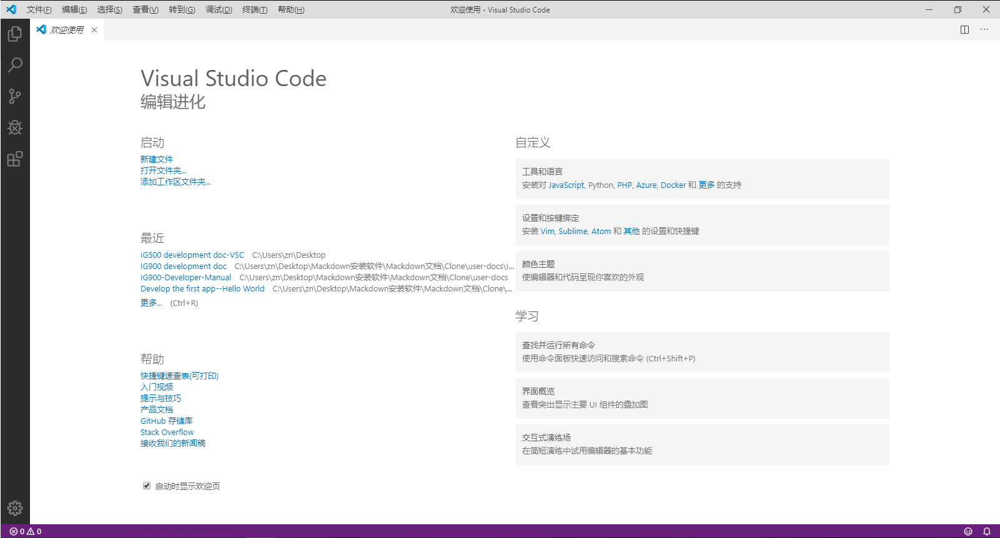

#### 2.3 安装OpenSSH
您可以访问：https://www.openssh.com 获取相应的OpenSSH工具并安装至PC，使PC支持SSH协议。

### 3. 准备VS Code开发环境
#### 3.1 安装VS Code扩展插件
为了在MobiusPi上开发并调试Python代码，您要在VS Code IDE的“Extensions”中安装以下必需的扩展插件：  
- `Python`：一个拥有丰富的功能特性的VS Code Python扩展插件，包括诸如IntelliSense、linting、调试、代码导航、代码格式化、Jupyter笔记本支持、重构、变量资源管理器、测试资源管理器、代码片段等功能！想要了解跟多详细信息，请访问该插件的[官方网页](https://code.visualstudio.com/docs/languages/python)。  
- `Project Templates`：一个支持基于自定义模板快速创建新项目的VS Code扩展插件。我们会发布若干Python App模板，您可以使用Project Templates导入模板，并快速初始化项目。  
- `SFTP`：您可以使用SFTP Sync插件将代码上传至MobiusPi中。
  

  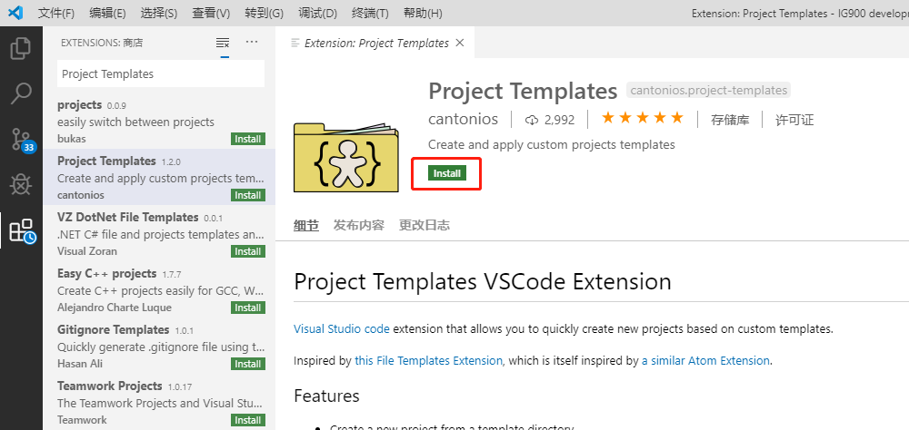  

    
 &nbsp;


至此，MobiusPi边缘计算平台开发所必需的插件安装完成。想要了解更多VS Code插件，请访问[Visual Studio Code官网](https://code.visualstudio.com/)。

#### 3.2 配置Python解释器版本
使用快捷键：`Ctrl+Shift+P`弹出命令面板，在命令面板中输入`>Python: select Interpreter`。
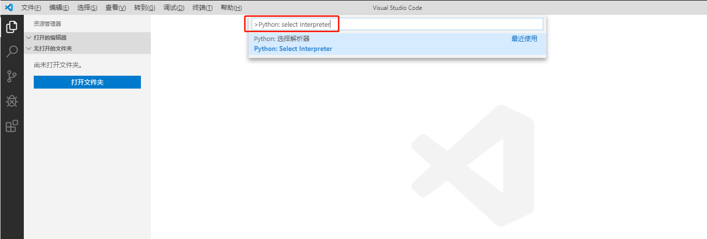
 &nbsp;

根据需要选择相应的Python解释器，本教程使用3.7.X版本的Python解释器（所选择的Python解释器版本应同“边缘计算>>Python边缘计算”页面的Python解释器一致）。选择后在VS Code左下角可以看到已选择的Python解释器版本。
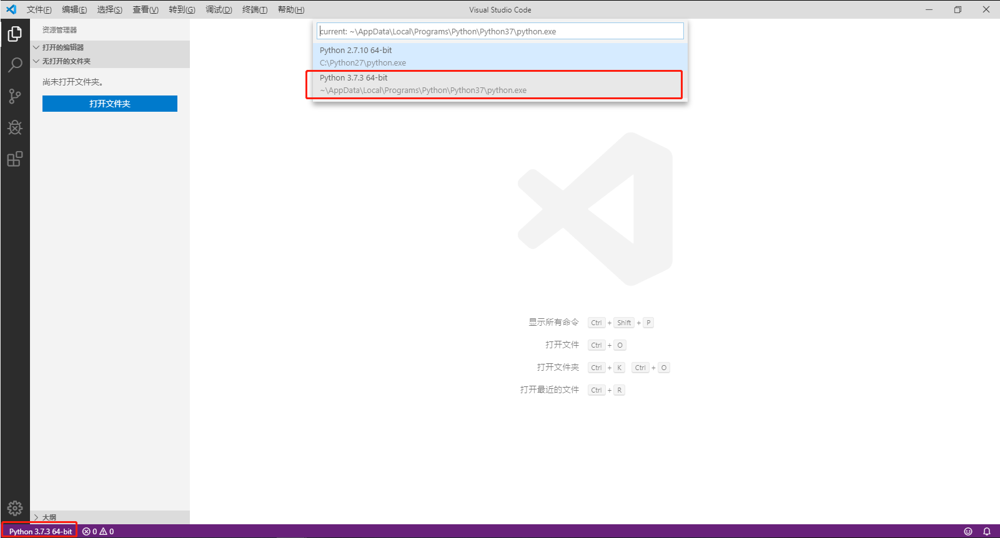

#### 3.3 配置工程模板
##### 3.3.1 使用映翰通标准工程模板
- 步骤1：请从[这里](https://github.com/inhandnet/MobiuspiProjectTemplates/releases)下载MobiusPi工程模板。  </br>
MobiusPi提供多种工程模板以方便您快速初始化工程目录。各工程模板的详细说明请参考[README.md](https://github.com/inhandnet/MobiuspiProjectTemplates)。本教程使用标准工程模板“helloworld-template”进行演示说明。  

 &nbsp;

- 步骤2：打开工程模板。  </br>
解压下载后的工程模板压缩包，使用VS Code打开解压文件夹中的helloworld-template文件夹，点击“文件>>打开文件夹”并选择的“helloworld-template”文件夹。

 &nbsp;

  打开工程模板文件夹“helloworld-template”后如下图所示，工程模板中包含以下内容：
  - `.vscode`：VS Code配置文件夹
    - `sftp.json`:SFTP插件的配置文件，用于与MobiusPi建立SFTP连接
  - `build`：App发布包文件夹
  - `src`：App源码文件夹
    - `main.py`：App入口
    - `parse_config.py`:解析App配置文件
  - `config.yaml`：App配置文件
  - `setup.py`:App版本、SDK版本等信息说明

  
 &nbsp;

- 步骤3：在命令面板中输入`>Project:Save Project as Template`命令以将当前工程文件存为模板。
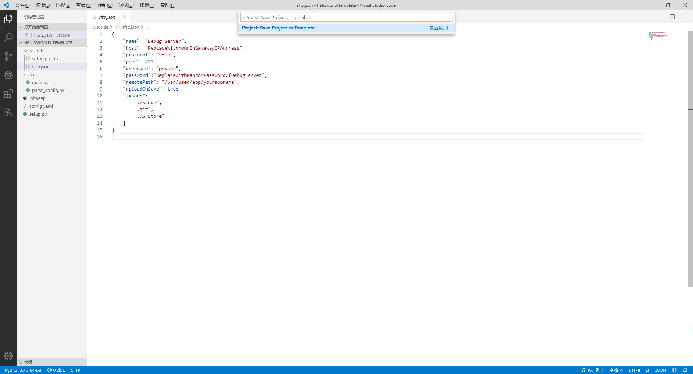
 &nbsp;

  定义您模板的名称，如：helloworld-template。


##### 3.3.2 自定义工程模板
- 步骤1：新建一个工程模板文件夹，文件夹中必须包含以下内容。其他文件可根据您的实际情况自行添加
  - `.vscode`：VS Code配置文件夹（在VS Code的命令面板中输入`>SFTP:Config` 命令可快速创建.vscode文件夹和sftp.json文件）
    - `sftp.json`:SFTP插件的配置文件，用于与MobiusPi建立SFTP连接
  - `build`：App发布包文件夹
  - `src`：App源码文件夹
    - `main.py`：App入口
  - `config.yaml`：App配置文件，内容可自定义
  - `setup.py`:App版本、SDK版本等信息说明，建议参照标准模板定义  
   &nbsp;

- 步骤2：使用VS Code打开自定义工程模板文件夹，点击“文件>>打开文件夹”并选择的自定义工程模板文件夹。
 &nbsp;

- 步骤3：在命令面板中输入`>Project:Save Project as Template`命令以将当前工程文件存为模板。

## 第二节 编写第一个MobiusPi App：Hello World
本教程以开发一个“HelloWorld”App为例说明如何通过VS Code实现MobiusPi Python App的开发。该App具备在MobiusPi中每10秒打印一条“hello world!”日志以及导入配置文件修改日志内容的功能。
### 1. 使用模板创建工程
- 步骤1：使用VS Code打开Python App的工程文件夹，打开后如下图所示：

 &nbsp;

- 步骤2：在命令面板中输入 `>Project:Create Project From Template`命令以通过已有模板快速创建工程目录。
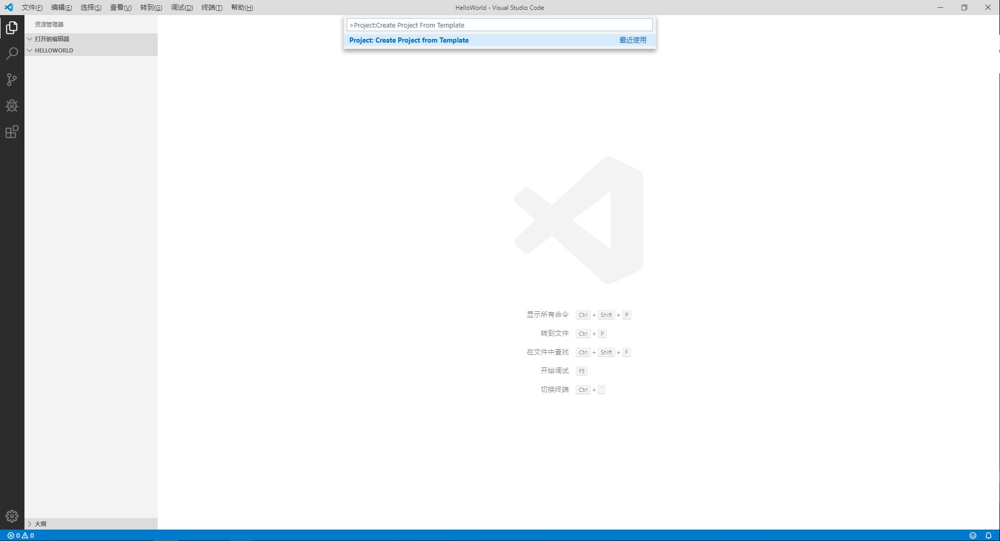
 &nbsp;

- 步骤3：输入helloworld-template模板的名称并回车。

 &nbsp;

  选择模板后VS Code会自动在当前工程目录下增加模板中包含的文件。
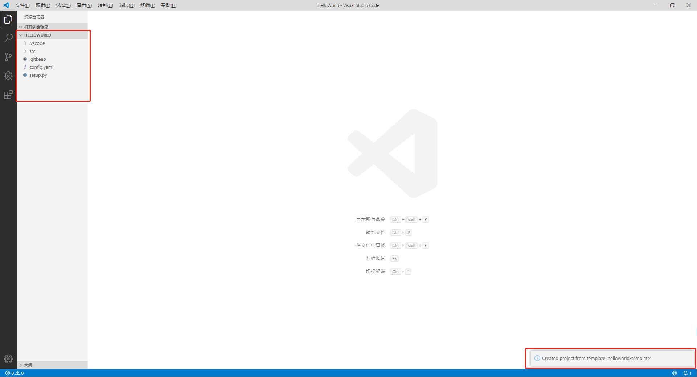

### 2. 编码
标准工程模板“helloworld-template”已经实现了在MobiusPi中每10秒打印一条“hello world!”日志以及导入配置文件修改日志内容的功能。如需修改App名称，请您参考下图修改main. py和setup.py中的代码。<font color=#FF0000>注意：Python App名称中不能包含空格。</font>
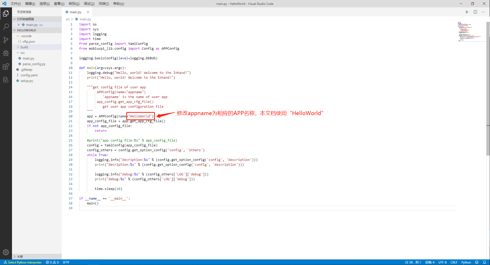  

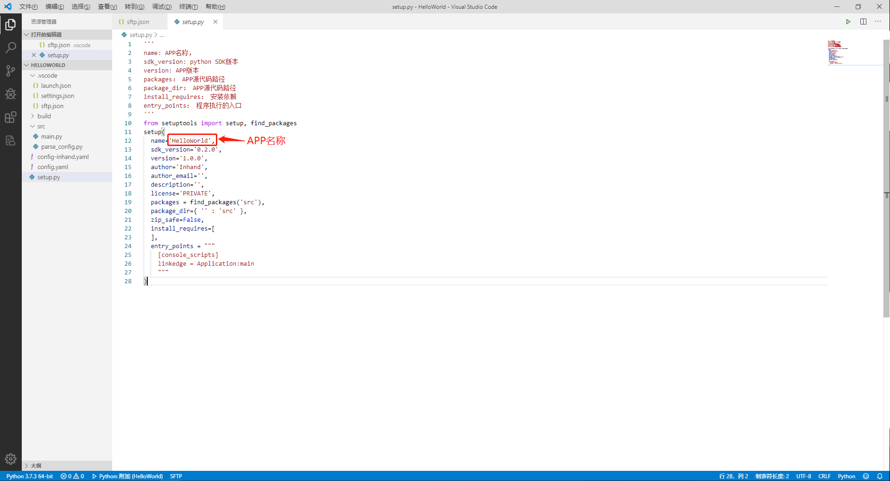

### 3. 调试
#### 3.1 建立SFTP连接
远程调试代码时需要先将本地代码上传到远程服务器（即MobiusPi）。上传本地代码前需要确认MobiusPi的调试模式已启用，启用调试模式后如下图所示：

 &nbsp;

- 步骤1：打开`sftp.json`文件  <br/>
  在命令面板中输入`>SFTP:Config` 命令后打开`sftp.json`文件。
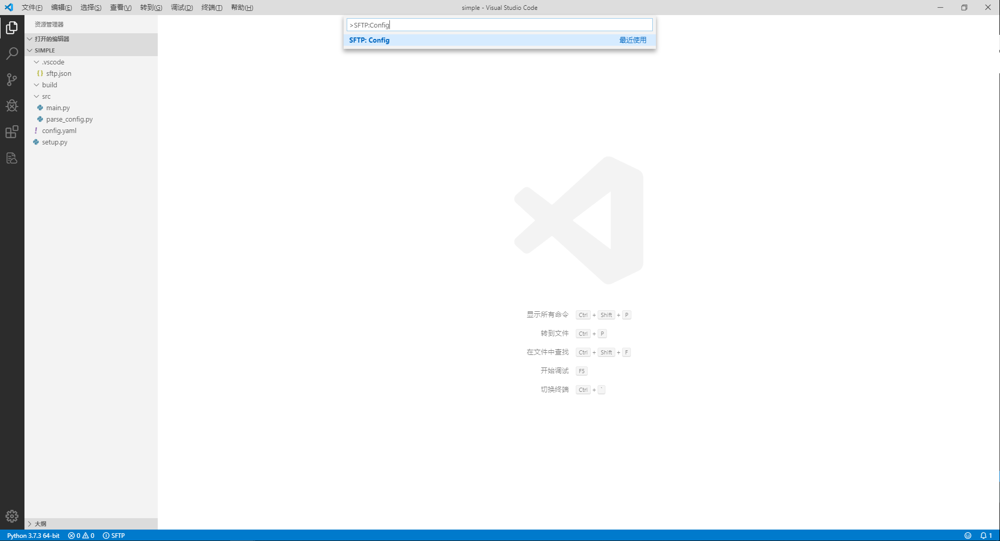
 &nbsp;

- 步骤2：配置SFTP连接  <br/>
  - 配置IG500 SFTP连接  
  
    在`sftp.json`文件中根据“边缘计算>>Python边缘计算”页面的连接参数配置SFTP连接。
  <font color=#FF0000>注意：Python App名称应与mian. py中的App名称保持一致。</font>

    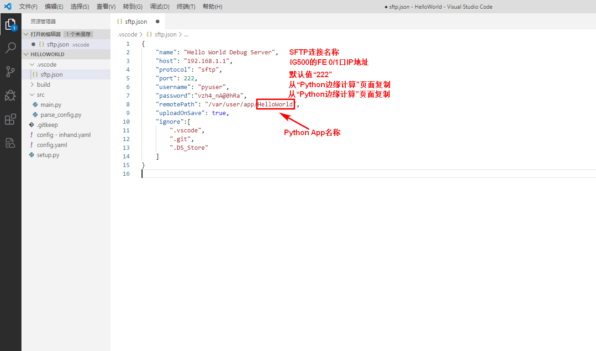  

   &nbsp;

  - 配置IG900 SFTP连接  
  
    在`sftp.json`文件中根据“边缘计算>>Python边缘计算”页面的连接参数配置SFTP连接。
  <font color=#FF0000>注意：Python App名称应与mian. py中的App名称保持一致。</font>

      
<br/>
  
- 步骤3：配置完成并保存后在命令面板中输入`>SFTP:Open SSH in Terminal`以连接远端的服务器。

 &nbsp;

- 步骤4：随后命令面板会提示您需要选择要连接的SFTP服务器，选择`sftp.json`中的SFTP服务器并回车即可。
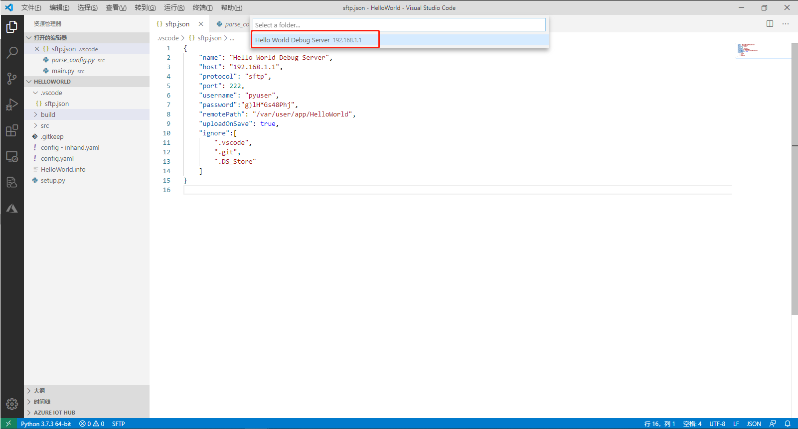
 &nbsp;

- 步骤5：首次连接时“终端”窗口会提示您是否要继续连接，此时输入“yes”并回车。随后再次在命令面板中输入`>SFTP:Open SSH in Terminal`和SFTP服务器的IP地址。

 &nbsp;

- 步骤6：“终端”窗口会提示您需要输入密码，您只需要将`sftp.json`文件中“password”项复制粘贴到此处即可。
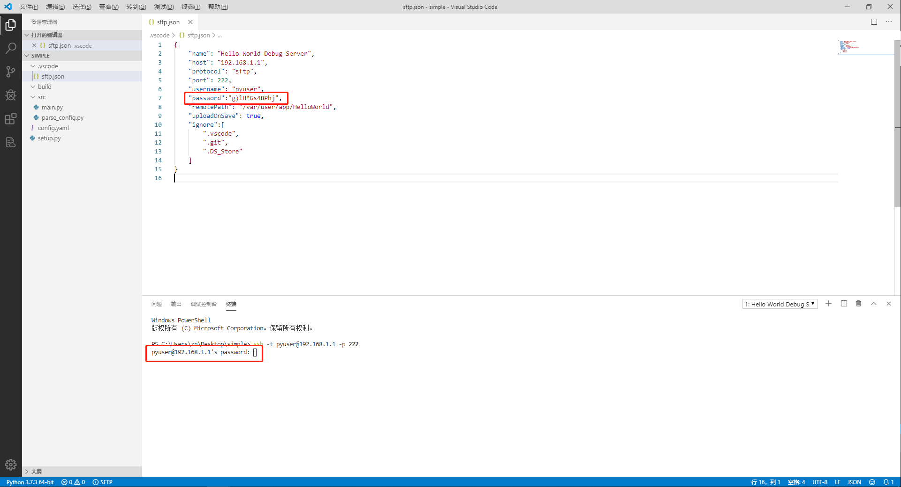
 &nbsp;

  成功与MobiusPi建立SFTP连接后如下图所示：


#### 3.2 调试代码
- 步骤1：同步代码  
  SFTP连接成功后，在左侧空白处右键选择“Sync Local->Remote”将代码同步到远程服务器，同步成功后本地修改或者删除代码时都会自动和远端服务器同步。
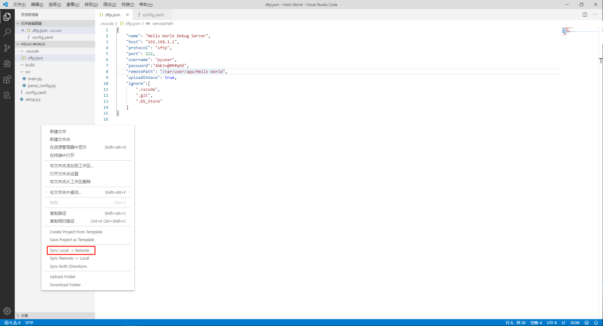
 &nbsp;

  可以在TERMINAL窗口查看远程服务器是否已接收到相应的App代码。在TERMINAL窗口输入以下命令查看已上传的App文件夹信息：
  ```
  cd app  
  ls -l
  ```
  
 &nbsp;

- 步骤2：在终端窗口调试脚本  
  同步代码后在终端窗口输入如下命令在IG500中立即执行脚本，执行脚本后在终端窗口查看执行结果：打印“hello world!”。
  ```
  python -m ptvsd --host 192.168.1.1 --port 3000 HelloWorld/src/main.py 
  ```
  - `192.168.1.1`为IG500的FE 0/1口的IP地址（<font color=#FF0000>使用IG900时，此处应填写GE 0/2口的IP地址</font>）
  - `3000`为建议的调试端口号
  - `HelloWorld/src/main.py`为mian. py的执行路径，请根据您的当前位置适当调整  <br/>
 &nbsp;

  MobiusPi的Python开发环境内置了ptvsd依赖库用于远程调试代码，想要了解更多ptvsd插件的用法，请访问[ptvsd使用说明](https://github.com/microsoft/ptvsd/)。
  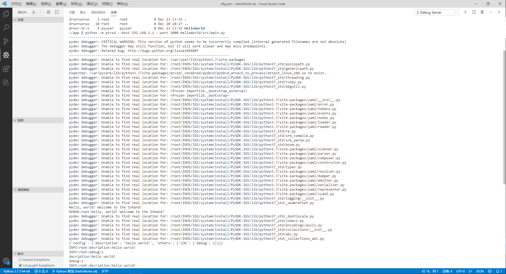
 &nbsp;

- 步骤3：调试完成后在终端使用`Ctrl + C`快捷键终止调试。
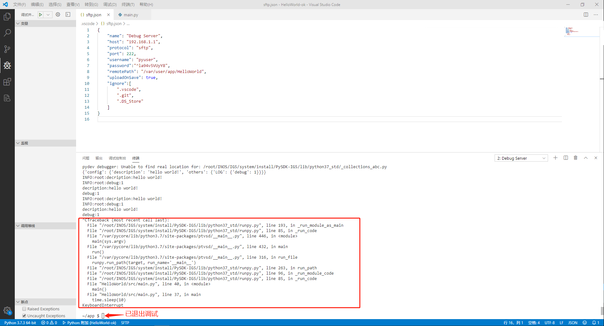

### 4. 构建App发布包
调试完毕后可以构建App发布包以便于将App快速部署至其他MobiusPi。
- 步骤1：构建App发布包  <br/>
  在“终端”窗口执行`build_py_app.sh HelloWorld`命令构建App发布包。（即build_py_app.sh Python App名称）
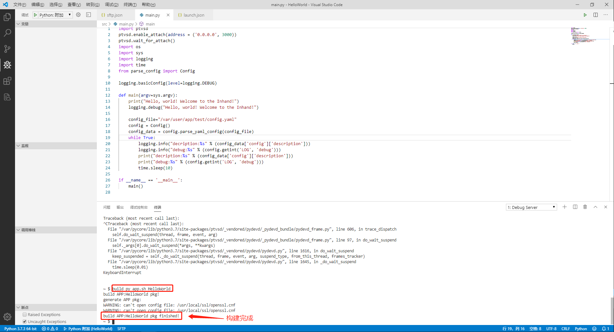
 &nbsp;

- 步骤2：下载App发布包  <br/>
  执行完成后在远程服务器的build目录下会自动生成App发布包。右键本地的“build”文件夹并选择“Download Folder”将构建好的App发布包下载到本地以便于后续部署。

 &nbsp;

  下载完成后在build目录下可以看到HelloWorld App发布包。
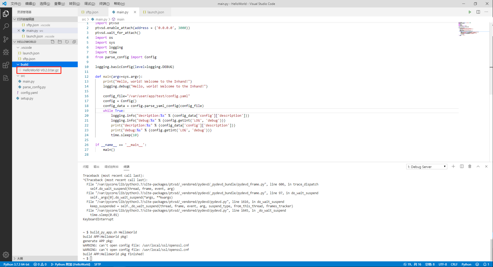

### 5. 通过InGateway Web页面部署App
执行构建App发布包命令后会自动在已连接的MobiusPi上生成对应的App,此App无法正常启动。请参考如下链接部署App至MobiusPi：
- [IG500部署App](https://ingateway-development-docs.readthedocs.io/zh_CN/latest/IG501%E5%BF%AB%E9%80%9F%E4%BD%BF%E7%94%A8%E6%89%8B%E5%86%8C.html#python-app)
- [IG900部署App](https://ingateway-development-docs.readthedocs.io/zh_CN/latest/IG902%E5%BF%AB%E9%80%9F%E4%BD%BF%E7%94%A8%E6%89%8B%E5%86%8C.html#python-app)

### 6. 查看App运行状态
在MobiusPi的“边缘计算>>Python边缘计算”页面可查看App的运行状态。
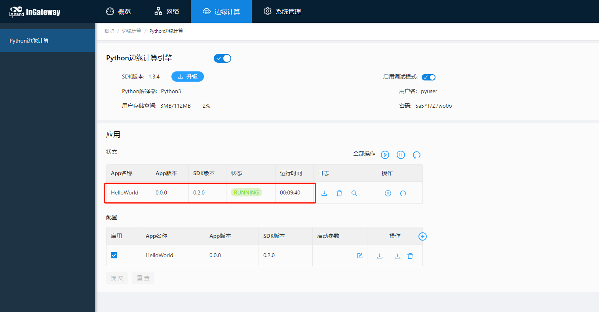

点击“查看日志”可查看App的运行日志。
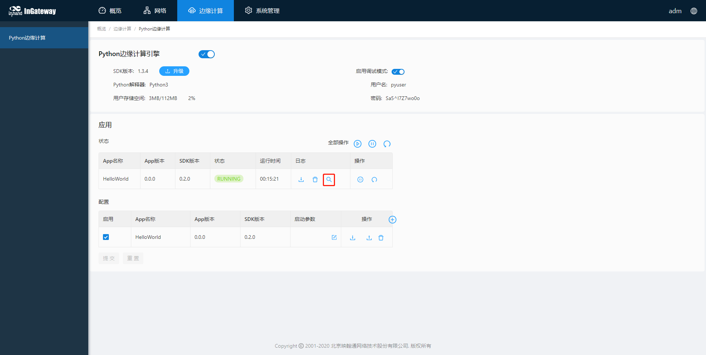  


### 7. 为App更新配置文件
- 步骤1：修改配置文件  <br/>
  将App的“config.yaml”中的配置```description: "hello world!"```修改为:```description: "hello inhand!"```  

   <br/>
 &nbsp;

- 步骤2：导入配置文件并重启App  <br/>
  在MobiusPi的“边缘计算>>Python边缘计算”页面为“HelloWorld”App导入修改后的配置文件并重启App。  

 &nbsp;

重启后“HelloWorld”App将按照更新后的配置文件运行，即每10秒打印一条"hello inhand!"日志。


### 8. 附录
#### 8.1 使用pip为App安装第三方依赖库
使用pip为App安装第三方依赖库时需启用MobiusPi的调试模式并且接入互联网，以下以HelloWorld App安装`xlrd`依赖库为例说明如何安装第三方依赖库：
  

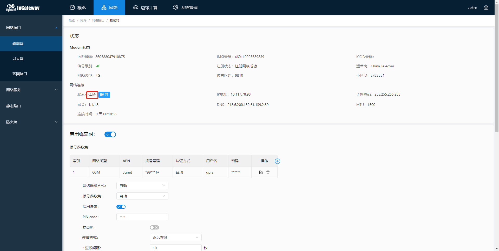
- 步骤1：使用VS Code与MobiusPi建立SFTP连接，详见[建立SFTP连接](https://readts.readthedocs.io/en/latest/QuickStart.html#sftp)。
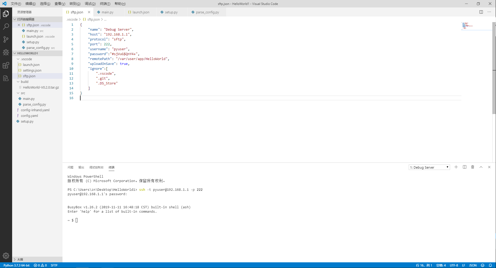
 &nbsp;

- 步骤2：执行pip install + “依赖库名称” + “==版本号” + “-t” + “App的lib文件夹路径”命令并回车以安装相应依赖库。（不加版本号时pip会自动安装最新版的依赖库） 
  ```
  pip install modbus_tk==1.1.0 -t /var/user/app/HelloWorld/lib/
  ```

  
 &nbsp;

- 步骤3：随后会自动下载并安装相应的依赖库，安装成功后如下图所示：
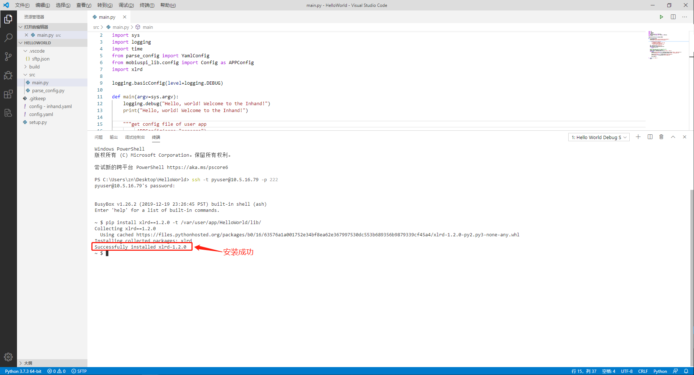
 &nbsp;

- 步骤4：使用`export`命令为App设置环境变量。在终端窗口执行以下命令（“HelloWorld”项需要根据实际的App名称调整）
  ```
  export LD_LIBRARY_PATH=$LD_LIBRARY_PATH:/var/user/app/HelloWorld/lib/  
  export PYTHONPATH=$PYTHONPATH:/var/user/app/HelloWorld/lib/
  ```
  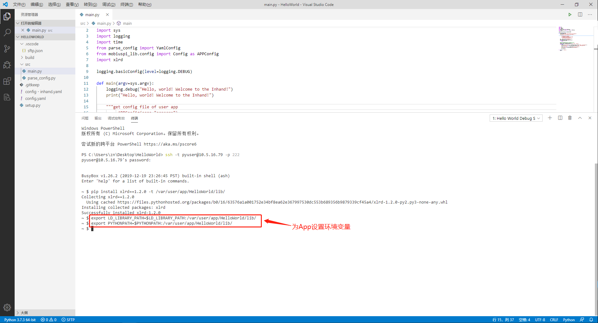
 &nbsp;

  为App安装第三方依赖库后，调试前必须要为该App配置相应的环境变量，否则调试时App将不能正常运行。在MobiusPi中启用App后会自动为该App添加App的lib文件夹下第三方依赖库的环境变量，无须手动配置。<br/>
 &nbsp;

- 步骤5：运行代码以确认App运行正常
  

#### 8.2 启用代码自动补全
为了提高编码效率，您可以通过Python扩展插件实现代码自动补全功能。
- 步骤1：点击“文件>>首选项>>设置”进入设置页面。

 &nbsp;

- 步骤2：选择设置页面中的“扩展>>Python”项，找到“Auto Complete: Extra Paths”项并点击“在setting.json中编辑”。
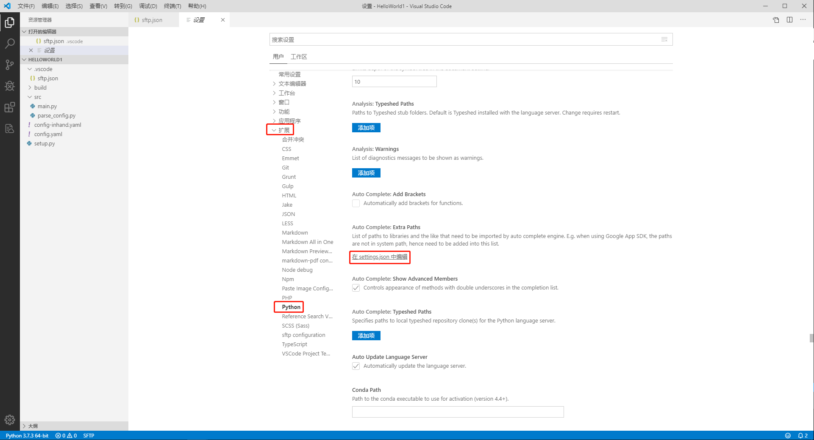
 &nbsp;

  在“settings.json”中增加如下配置项并保存（python.pythonPath为python解释器的安装路径）
  ```
  "python.linting.pylintEnabled":false,
  "python.linting.flake8Enabled":true,
  "python.jediEnabled":true,
  "terminal.integrated.rendererType":"dom",
  "explorer.confirmDelete":false,
  "python.pythonPath":"C:/Users/zn/AppData/Local/Programs/Python/Python37",
  ```
  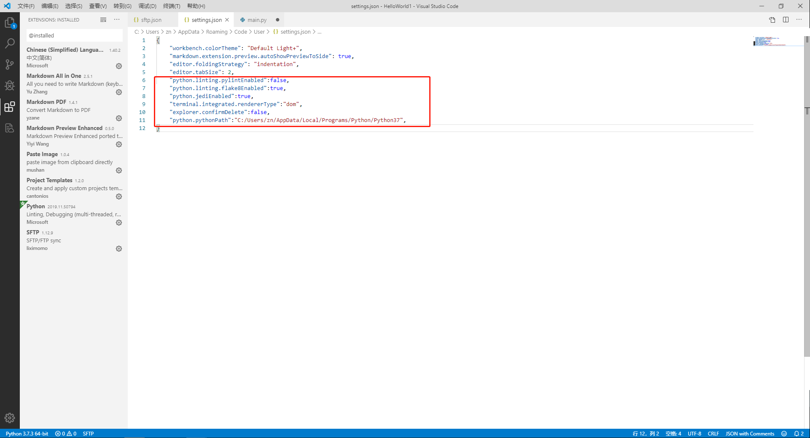

#### 8.3 FAQ
- Q1:建立SFTP连接时提示远程主机标识更新，认证失败应该怎么办？
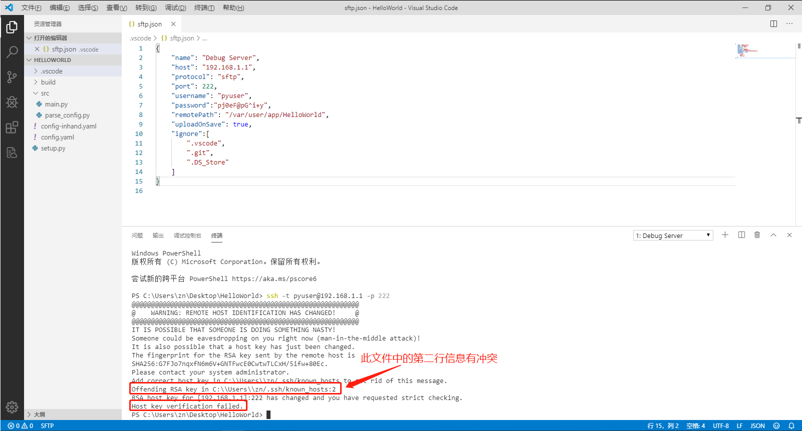
 &nbsp;

  A1：出现此问题的原因是因为MobiusPi的密钥更新了，但是PC上的密钥还未更新导致认证失败。此时您只需要删掉密钥文件中有冲突的那一行即可。(按住Ctrl并单击冲突项可以快速访问链接)

 &nbsp;

  删除后再次使用`>SFTP:Open SSH in Terminal`命令即可成功建立SFTP连接。

 &nbsp;

- Q2:建立SFTP连接后，在左侧空白处右键选择”Sync Local->Remote”将代码同步到远程服务器时提示“配置的身份验证方法失败”怎么解决？
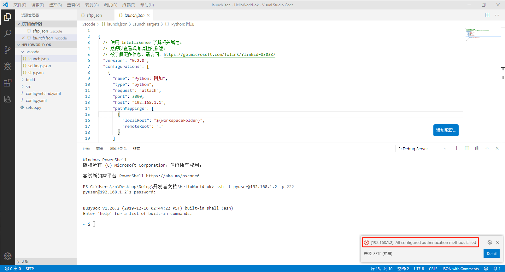
 &nbsp;

  A2:确保“sftp.json”文件中的password项与MobiusPi的密码一致。一致后重新建立SFTP连接并同步代码。
  <br> </br>
- Q3：在开发过程中需要使用IG900的串口和网口，如何调用？
  
  A3：RS485串口名称为：`/dev/ttyO3`；RS232串口名称为：`/dev/ttyO1`。串口和网口均可以使用Python标准的串口/网口使用方法进行调用，如使用`pyserial`库调用串口。
  <br> </br>
- Q4：与MobiusPi建立SFTP连接时提示“SSH错误”，如下图所示：  
  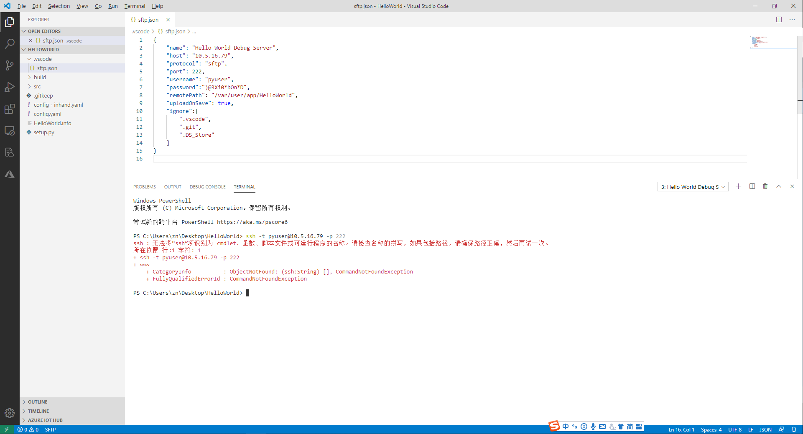  

  A4：请安装OpenSSH工具以支持SSH协议。您可以访问：https://www.openssh.com 获取相应的OpenSSH工具。